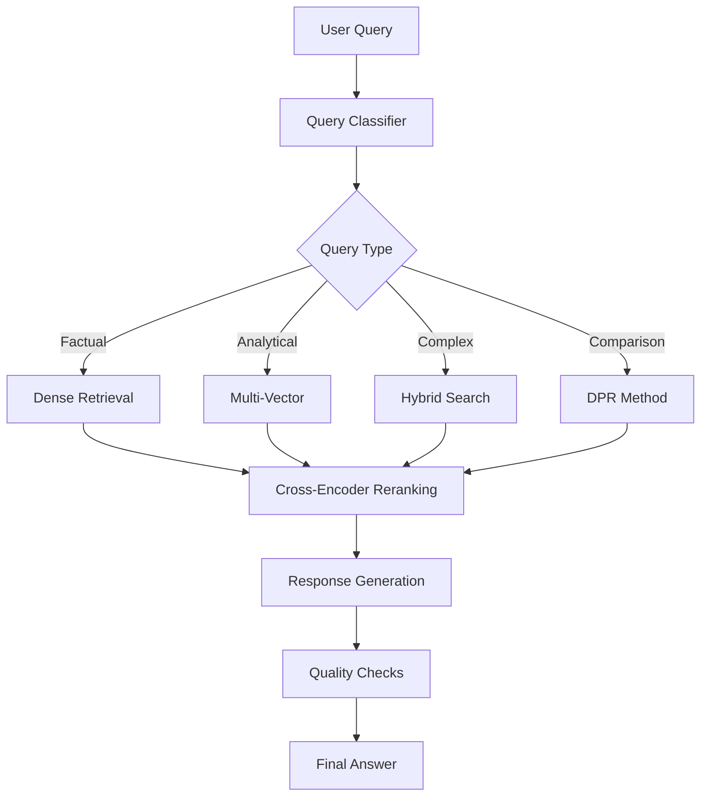

# 🚀 Advanced RAG System v2.0

A state-of-the-art Retrieval-Augmented Generation system with cutting-edge features for production-ready document analysis and question answering.

## 🌟 Key Features

### 🔍 **Multi-Strategy Retrieval**
- **Dense Retrieval**: Semantic search using SentenceTransformers
- **Sparse Retrieval**: Traditional TF-IDF and BM25 methods  
- **Hybrid Search**: Intelligent combination of dense and sparse
- **DPR (Dense Passage Retrieval)**: Facebook's state-of-the-art retrieval
- **Multi-Vector**: Ensemble approach with multiple embedding models

### 📄 **Advanced Document Processing**
- **Multi-modal Support**: Extract text, tables, and images from PDFs
- **Smart Chunking**: 4 different strategies (recursive, semantic, hierarchical, hybrid)
- **Table Extraction**: Multiple methods (Camelot, Tabula, PyTesseract)
- **Image Captioning**: AI-powered image understanding
- **Metadata Enrichment**: Comprehensive document metadata

### 🧠 **Intelligent Query Processing**
- **Query Classification**: Automatic query type detection
- **Intent Recognition**: Understanding user goals
- **Entity Extraction**: Named entity recognition
- **Complexity Analysis**: Smart difficulty assessment
- **Strategy Routing**: Automatic optimal strategy selection

### 📊 **Advanced Evaluation & Analytics**
- **RAGAS Integration**: State-of-the-art RAG evaluation metrics
- **Real-time Benchmarking**: Performance comparison across strategies
- **Quality Metrics**: Precision@K, Recall@K, F1, MRR
- **Interactive Dashboards**: Beautiful visualizations with Plotly
- **Performance Monitoring**: Response times, success rates, user feedback

### 🛡️ **Production-Ready Features**
- **Safety Guardrails**: Toxicity detection and content filtering
- **Memory Management**: Conversation history and learning
- **Async Processing**: High-performance concurrent operations
- **API Interface**: RESTful FastAPI with automatic documentation
- **Web UI**: Streamlit interface for easy interaction
- **Caching**: Intelligent response caching for performance

### 🎯 **Advanced Capabilities**
- **Adaptive Learning**: System improves from user feedback
- **3D Visualization**: UMAP embedding space exploration
- **Multi-modal Understanding**: Images, tables, and text analysis
- **Confidence Scoring**: Reliability assessment for each answer
- **Quality Checks**: Hallucination detection and grounding verification

## 🚀 Quick Start

### 1. Installation

```bash
# Clone the repository
git clone https://github.com/your-repo/advanced-rag-system.git
cd advanced-rag-system

# Install dependencies
pip install -r requirements_advanced.txt

# Install system dependencies (Ubuntu/Debian)
sudo apt-get install tesseract-ocr poppler-utils ghostscript

# Download spaCy model
python -m spacy download en_core_web_sm
```

### 2. Environment Setup

```bash
# Set your OpenAI API key
export OPENAI_API_KEY="your-openai-api-key-here"

# Optional: Configure other settings
cp config_advanced.yaml config.yaml
# Edit config.yaml as needed
```

### 3. Run the System

#### Option A: API Server
```bash
# Start the FastAPI server
python advanced_rag_system_part2.py

# Access the API at http://localhost:8000
# API documentation at http://localhost:8000/docs
```

#### Option B: Streamlit Web UI
```bash
# Start the Streamlit interface
streamlit run advanced_rag_system_part2.py

# Access the web UI at http://localhost:8501
```

#### Option C: Demo Script
```bash
# Run comprehensive demonstration
python demo_advanced_rag.py
```

## 📖 Usage Examples

### Basic Query Processing

```python
from advanced_rag_system_part2 import AdvancedRAGSystem
import asyncio

# Initialize the system
rag_system = AdvancedRAGSystem()

# Add a document
await rag_system.add_document_async("path/to/your/document.pdf")

# Process a query
result = await rag_system.process_query_async(
    query="What was the total revenue?",
    strategy="hybrid",  # or None for auto-selection
    k=5,
    include_analysis=True
)

print(f"Answer: {result.answer}")
print(f"Confidence: {result.confidence_score}")
print(f"Strategy: {result.retrieval_strategy}")
```

### API Usage

```python
import requests

# Query endpoint
response = requests.post("http://localhost:8000/query", json={
    "query": "What are the main business segments?",
    "strategy": "hybrid",
    "k": 5,
    "include_analysis": True
})

result = response.json()
print(f"Answer: {result['answer']}")
```

### Advanced Features

```python
# Benchmark different strategies
benchmark_results = rag_system.benchmark_system([
    "What was the revenue?",
    "How did the company perform?",
    "What are the key risks?"
])

# Get system analytics
analytics = rag_system.get_analytics()
print(f"Total queries: {analytics['performance_metrics']['total_queries']}")

# Add user feedback
rag_system.add_feedback("query_id", rating=4.5, comments="Great answer!")
```

## 🏗️ Architecture

### System Components

```
┌─────────────────────────────────────────────────────────────┐
│                    Advanced RAG System                     │
├─────────────────────────────────────────────────────────────┤
│  🌐 Interfaces                                             │
│  ├── FastAPI Server (REST API)                             │
│  ├── Streamlit Web UI                                      │
│  └── Python SDK                                            │
├─────────────────────────────────────────────────────────────┤
│  🧠 Core Processing Engine                                 │
│  ├── Query Classifier & Router                             │
│  ├── Multi-Strategy Retriever                              │
│  ├── Response Generator                                     │
│  └── Quality & Safety Checks                               │
├─────────────────────────────────────────────────────────────┤
│  📄 Document Processing                                    │
│  ├── Multi-modal Extractor                                 │
│  ├── Advanced Chunker                                      │
│  ├── Embedding Generator                                    │
│  └── Metadata Enricher                                     │
├─────────────────────────────────────────────────────────────┤
│  💾 Storage & Memory                                       │
│  ├── ChromaDB Vector Store                                 │
│  ├── Conversation Memory                                    │
│  ├── User Feedback Store                                   │
│  └── Performance Cache                                     │
├─────────────────────────────────────────────────────────────┤
│  📊 Analytics & Monitoring                                │
│  ├── Real-time Metrics                                     │
│  ├── Performance Benchmarks                                │
│  ├── Quality Evaluation                                    │
│  └── Interactive Visualizations                            │
└─────────────────────────────────────────────────────────────┘
```

### Retrieval Strategies Flow



## 🔧 Configuration

The system is highly configurable through `config_advanced.yaml`:

### Key Configuration Sections

- **Document Processing**: Chunking strategies, multi-modal settings
- **Embeddings**: Model selection, dimensions, caching
- **Retrieval**: Strategy weights, hybrid parameters
- **Generation**: OpenAI settings, quality thresholds
- **Safety**: Guardrails, content filtering
- **Performance**: Caching, async settings, GPU support

### Example Configuration

```yaml
retrieval:
  default_strategy: "hybrid"
  strategies:
    hybrid:
      dense_weight: 0.6
      sparse_weight: 0.4
      rerank: true

generation:
  openai:
    model: "gpt-3.5-turbo"
    max_tokens: 1000
    temperature: 0.1

safety:
  guardrails:
    enabled: true
    toxicity_threshold: 0.1
```

## 📊 Evaluation & Benchmarking

### Supported Metrics

- **Retrieval Metrics**: Precision@K, Recall@K, F1-Score, MRR
- **Generation Metrics**: Answer Relevancy, Faithfulness, Context Precision
- **System Metrics**: Response Time, Success Rate, User Satisfaction

### Running Evaluations

```python
# Benchmark retrieval strategies
evaluator = RAGEvaluator()
results = evaluator.benchmark_strategies(test_queries, retriever)

# RAGAS evaluation
ragas_results = evaluator.evaluate_generation(
    questions=questions,
    answers=answers,
    contexts=contexts,
    ground_truth=ground_truth
)
```

## 🎨 Visualization Features

### 3D Embedding Visualization
- Interactive UMAP projections
- Query-document relationships
- Strategy comparison views

### Performance Dashboards
- Real-time metrics
- Strategy comparisons
- User feedback analytics

### Query Analytics
- Query type distributions
- Complexity patterns
- Success rate trends

## 🛡️ Security & Safety

### Built-in Guardrails
- **Toxicity Detection**: Harmful content filtering
- **Quality Checks**: Response grounding verification
- **Input Validation**: Query and file safety checks
- **Rate Limiting**: API protection

### Privacy Features
- Local processing options
- Data encryption support
- Audit logging
- User consent management

## 🚀 Advanced Use Cases

### 1. Enterprise Document Analysis
```python
# Process large document collections
for document in document_collection:
    await rag_system.add_document_async(document, chunking_strategy="hierarchical")

# Query with business intelligence
result = await rag_system.process_query_async(
    "Analyze quarterly performance trends and identify growth opportunities"
)
```

### 2. Research Assistant
```python
# Multi-document comparative analysis
result = await rag_system.process_query_async(
    "Compare the methodologies used in these research papers",
    strategy="multi_vector",
    k=10
)
```

### 3. Customer Support
```python
# Context-aware responses with memory
result = await rag_system.process_query_async(
    "How can I resolve the billing issue we discussed earlier?",
    include_analysis=True
)
```

## 📈 Performance Optimization

### Optimization Strategies
- **Caching**: Intelligent query and response caching
- **Async Processing**: Concurrent document processing
- **Batch Operations**: Efficient embedding generation
- **Model Optimization**: Quantization and acceleration
- **Memory Management**: Smart conversation history

### Scaling Considerations
- **Horizontal Scaling**: Multi-instance deployment
- **Database Optimization**: Vector index tuning
- **Resource Management**: CPU/GPU optimization
- **Load Balancing**: Request distribution

## 🔍 Troubleshooting

### Common Issues

1. **Model Download Failures**
   ```bash
   # Clear cache and retry
   rm -rf ~/.cache/torch/sentence_transformers/
   python -c "from sentence_transformers import SentenceTransformer; SentenceTransformer('all-mpnet-base-v2')"
   ```

2. **ChromaDB Connection Issues**
   ```bash
   # Reset database
   rm -rf ./chroma_db/
   # Restart the system
   ```

3. **Memory Issues**
   ```yaml
   # Reduce batch sizes in config
   vector_db:
     chromadb:
       max_batch_size: 100
   ```

### Debug Mode
```bash
# Enable debug logging
export LOG_LEVEL=DEBUG
python advanced_rag_system_part2.py
```

## 🤝 Contributing

We welcome contributions! Areas for improvement:

- Additional retrieval strategies
- New evaluation metrics
- Multi-language support
- Enhanced visualizations
- Performance optimizations

### Development Setup
```bash
# Install development dependencies
pip install -r requirements_advanced.txt
pip install black flake8 pytest pytest-asyncio

# Run tests
pytest tests/

# Format code
black .
```

## 📄 License

This project is licensed under the MIT License - see the [LICENSE](LICENSE) file for details.

## 🎯 Roadmap

### Version 2.1 (Coming Soon)
- [ ] Multi-language support
- [ ] Graph-based retrieval
- [ ] Real-time streaming responses
- [ ] Advanced caching mechanisms

### Version 2.2
- [ ] Federated search across multiple sources
- [ ] Custom model fine-tuning
- [ ] Advanced security features
- [ ] Mobile-optimized interface

## 📞 Support

- **Documentation**: [Full Documentation](docs/)
- **Issues**: [GitHub Issues](https://github.com/your-repo/issues)
- **Discussions**: [GitHub Discussions](https://github.com/your-repo/discussions)
- **Email**: support@your-domain.com

## 🙏 Acknowledgments

This advanced RAG system builds upon excellent open-source projects:
- [LangChain](https://langchain.com/) for document processing
- [ChromaDB](https://www.trychroma.com/) for vector storage
- [SentenceTransformers](https://www.sbert.net/) for embeddings
- [RAGAS](https://github.com/explodinggradients/ragas) for evaluation
- [FastAPI](https://fastapi.tiangolo.com/) for API framework
- [Streamlit](https://streamlit.io/) for web interface

---

**Built with ❤️ for the RAG community**

[](https://python.org)
[](LICENSE)
[](https://github.com/your-repo/advanced-rag-system) 